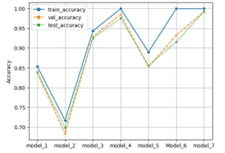
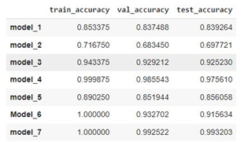

# Blood Cell Classification Using CNN Architectures

### Background

The realm of image classification and object detection has undergone a transformative journey, fueled by the advent of Convolutional Neural Networks (CNNs). 

Originating with LeNet-5 in the late 1990s, the field experienced milestones such as AlexNet's breakthrough in 2012, setting new standards in accuracy. 

Subsequent architectures like VGGNet, GoogLeNet, and ResNet further advanced capabilities, with transfer learning strategies democratizing deep learning.

Object detection saw a paradigm shift with R-CNN, Fast R-CNN, and Faster R-CNN, while SSD and YOLO brought real-time efficiency.

Recent trends include attention mechanisms like Vision Transformer, addressing long-range dependencies. 

Our project focuses on key architectures, from CNNs to ResNet, to enhance the accuracy and efficiency of blood cell image analysis. 

The subsequent sections delve into the specifics of our approach.

### Objectives

Using the blood cell images dataset sourced from [Kaggle](https://www.kaggle.com/datasets/romainroure/blood-cells-4-classes-dataset)

We wanted to test the performance of different CNN models in recognizing blood cell types. 

Two different architectures of CNNs, the first type of architecture has been inspired from the paper [Kandel et. al, App. Sci. 2020] (https://www.mdpi.com/2076-3417/10/8/2929),

and the second type derive from the "ResNet50" architecture.

### Prerequisites

All required libraries are given in the file requiments.txt

### Data processing

Consisting of 12,500 augmented blood cell images in JPEG format, accompanied by cell type labels in a CSV file. 

These images are distributed across four distinct cell type folders (Eosinophil, Lymphocyte, Monocyte, and Neutrophil). 

Each cell type category comprises approximately 3,000 images, contributing to a balanced dataset representation for classification purposes.

Grouping the images (while retaining the classes) into a single folder was done in order to perform our own Train/Validation/Test split in our script (dataset available on Kaggle).

### Modeling

The first architecture draws inspiration from the paper titled "A Novel Architecture to Classify Histopathology Images Using Convolutional Neural Networks." 

This approach integrates innovative concepts from the paper to create a robust model for accurately classifying blood cell images.

We consider eLu AS activation function based on the paper and deploy it into 4 models : 

	- Model 1 (optimizer = ADAM)

	- Model 2 (optimizer = RMSprop) 

	- Model 3 (optimizer= SGD)  

	- Model 4 (optimizer = SGD + adding to 2 drop out layer in classification blocks)

The second architecture is based on ResNet (Residual Networks), a widely acclaimed and influential deep learning architecture. 

By leveraging ResNet's unique residual learning framework, our project aims to capitalize on its proven effectiveness in image classification tasks.

We tested 3 models : 

	- Model 5 (no training)

	- Model 6 (partial training)

	- Model 7 (full training).

Together, these two architectures form the cornerstone of our blood cell classification initiative, each contributing distinct strengths to the overall success of the project.

### Conclusion

As a conclusion of this project we have seen that we have found 2 models derived from different architectures that are capable of classifying

blood cell types succesfully. Both the performance of a CNN (eLu activation function and SGD optimizer (model4)) and a fully trained ResNet50 are capable

reach impressive accuracy values. From a critical point of view, it could possible that our models could be overfitted to our dataset, as the images come

from a particular microscopy imaging set up. Nevertheless the models will be very useful for images coming from a similar imaging setup and could greatly enhance 

blood cell classification in settings such as a highthrouput screening or blood testing platform.

## Authors

- Romain Roure
- Rami Louati
- Romain Duhomme
- Diego Carriel Lopez